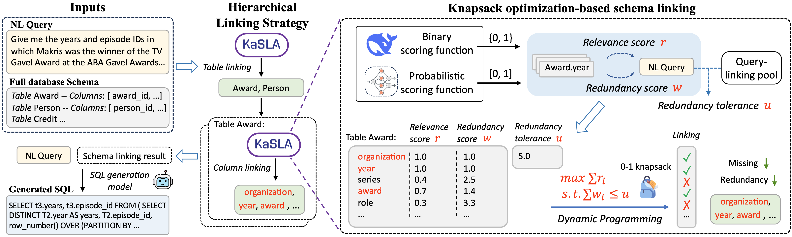

<div align="center">

# KaSLA: Knapsack Optimization-based Schema Linking for LLM-based Text-to-SQL

[](./ICDE26_KaSLA.pdf)

**Official implementation of the ICDE 2026 paper**
*"Knapsack Optimization-based Schema Linking for LLM-based Text-to-SQL Generation"*

Zheng Yuan, Hao Chen, Zijin Hong, Qinggang Zhang, Feiran Huang, Qing Li, Xiao Huang

*The Hong Kong Polytechnic University · City University of Macau · Jinan University*

</div>

---

## 🔎 Overview

Text-to-SQL systems built on Large Language Models (LLMs) critically depend on an accurate **schema linking** stage — the mapping of a natural-language query to the relevant tables and columns of the target database. However:

- **Missing** a single relevant schema element makes downstream SQL generation fail.
- **Redundant** schema elements dilute the prompt, hurt reasoning, and inflate cost.
- Traditional metrics (Recall / Precision / F1) **do not penalize missing-but-critical elements strongly enough**, masking real failures.

**KaSLA** reformulates schema linking as a **0-1 knapsack optimization** problem that explicitly balances *relevance* against a bounded tolerance of *redundancy*, guided by both a binary and a probabilistic scoring model. A hierarchical strategy first selects tables, then columns *within* the selected tables, drastically shrinking the candidate space.

<p align="center">
  
  <br/>
  <sub>
  <b>Figure 1.</b> KaSLA serves as a plug-in schema linker: a binary model and a probabilistic model jointly produce relevance / redundancy scores; a 0-1 knapsack solver then selects the optimal tables and columns subject to a data-driven redundancy tolerance.
  </sub>
</p>

---

## ✨ Key Contributions

1. **Enhanced metrics `Recall⁺` / `Precision⁺` / `F1⁺`.** A *restricted missing indicator* zeroes out the score when any essential schema element is missed, aligning metric outcomes with actual SQL-generation success.
2. **Knapsack-based schema linking.** Formulate linking as a 0-1 knapsack: maximize total estimated relevance while keeping total redundancy below a tolerance bound `u`.
3. **Hierarchical linking strategy.** Select tables first, then columns within those tables — reducing the combinatorial search space and error propagation.
4. **Data-driven redundancy tolerance.** Estimate `u` by aggregating (via `max`) the cumulative weights of ground-truth links retrieved from a query-linking pool of similar training queries.

---

## 📦 Data

Because some files exceed GitHub's 100 MB limit, we host them on Google Drive:

👉 **Download:** <https://drive.google.com/file/d/1vv_6ZdOGGsMZ1P0emPIPn4ZE7A8qKNak/view?usp=sharing>

After extraction, place the files under `KaSLA/data/` so the tree looks like:

```
data/
├── bird_dev_full.json
├── spider_dev_full.json
├── SL_ranking_probs/
│   ├── SL_recall_bird_train_perT.json
│   ├── SL_recall_bird_dev_perT.json
│   ├── SL_ideal_bird_train_results.json
│   ├── SL_recall_spider_train_perT.json
│   ├── SL_recall_spider_dev_perT.json
│   ├── SL_ideal_spider_train_results.json
│   ├── bird_question_similarities_pool_dev.npy
│   └── spider_question_similarities_pool_dev.npy
└── train_datasets/
    └── ...
```

The raw benchmarks are publicly available:
- **BIRD:** <https://bird-bench.github.io/>
- **Spider:** <https://yale-lily.github.io/spider>

---

## 🔧 Pipeline & Reproducibility

KaSLA is a **plug-in** schema linker. The full pipeline is:

```
┌───────────────────┐   ┌──────────────────────┐   ┌──────────────────┐   ┌────────────────┐
│  Raw BIRD/Spider  │ → │  Binary scoring +    │ → │  KaSLA knapsack  │ → │ Text-to-SQL    │
│  natural-lang Qs  │   │  Probabilistic       │   │  optimizer       │   │ generator      │
│                   │   │  scoring models      │   │                  │   │                │
└───────────────────┘   └──────────────────────┘   └──────────────────┘   └────────────────┘
```

### Step 1: Train the Binary Scoring Model (Generative Linker)

Use `src/finetune.py` (built on [LLaMA-Factory](https://github.com/hiyouga/LlamaFactory)) to fine-tune an LLM as the binary scoring model, then run inference via `src/incontextlearning.py` to produce generative schema linking predictions → `icl-results/`.

### Step 2: Train the Probabilistic Scoring Model

Follow [CodeS](https://github.com/RUCKBReasoning/codes) to train the schema item classifier. This produces the per-table/column probability rankings → `data/SL_ranking_probs/`.

> **Quick path:** The pre-computed outputs of Step 1 & 2 are provided in the [Google Drive bundle](#-data), so you can skip directly to Step 3.

### Step 3: Apply KaSLA

```bash
python KaSLA.py
```

KaSLA combines the binary and probabilistic signals via 0-1 knapsack optimization with data-driven redundancy tolerance. Edit the `SL_file_path` variable at the bottom of `KaSLA.py` to target a different input file.

### Step 4: Evaluate Schema Linking

```bash
bash eval_schema-linking.sh
```

The evaluator reports `Recall⁺`, `Precision⁺` and `F1⁺` for both tables and columns.

### Step 5: Downstream SQL Generation

Plug the KaSLA schema linking results into a Text-to-SQL generator (e.g., via `src/eval_ours.py` or `src/incontextlearning.py`) to generate and evaluate SQL.

---

## 📚 Citation

If you find KaSLA useful in your research, please cite:

```bibtex
@inproceedings{yuan2026kasla,
  title     = {Knapsack Optimization-based Schema Linking for LLM-based Text-to-SQL Generation},
  author    = {Yuan, Zheng and Chen, Hao and Hong, Zijin and Zhang, Qinggang and
               Huang, Feiran and Li, Qing and Huang, Xiao},
  booktitle = {Proceedings of the 42nd IEEE International Conference on Data Engineering (ICDE)},
  year      = {2026}
}
```

---

## 🙏 Acknowledgements

We thank the authors of the following projects:

- [LLaMA-Factory](https://github.com/hiyouga/LlamaFactory) — The fine-tuning engine used for training our binary scoring model.
- [CodeS](https://github.com/RUCKBReasoning/codes) — Our probabilistic scoring model is trained following their schema item classifier framework.
- [BIRD](https://bird-bench.github.io/) and [Spider](https://yale-lily.github.io/spider) — The datasets used for training and evaluation.

---

## 📝 License

This project is released under the [MIT License](./LICENSE).
